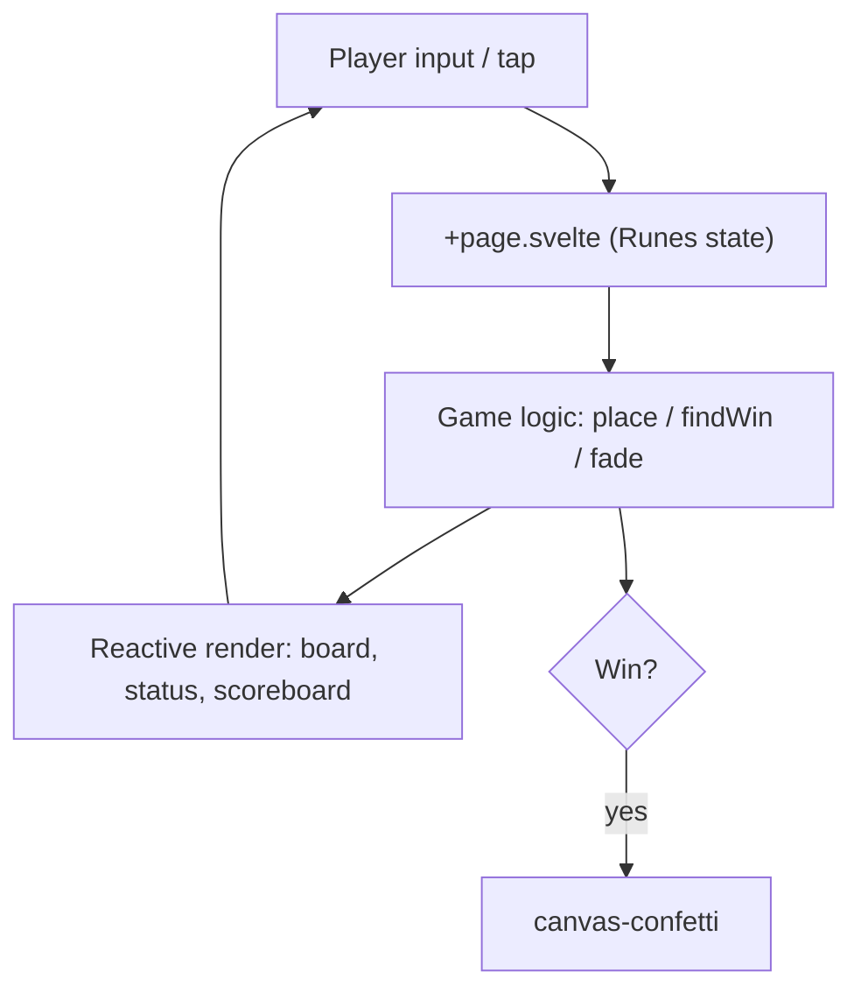

# ticae（消える三目並べ）Spec

**Created:** 2026-06-01
**Updated:** 2026-06-01

---

## 1. Overview

### Problem Statement
通常の三目並べは盤面がすぐ埋まって引き分けに終わりやすく、数手で展開が固定化して飽きやすい。盤面が膠着すると勝負がつかず、繰り返し遊ぶ動機が弱い。

### Goal
各プレイヤーの最新3手だけを盤面に残す「消える」ルールにより、引き分けが構造的に発生しない無限三目並べを提供する。1台の端末で交互に操作するローカル2人対戦を、スマホ片手操作でも快適に遊べる形で成立させる。

### Non-Goals
- オンライン対戦・通信機能（ローカル同一端末のみ）
- AI / CPU 対戦
- ユーザー認証、スコアのサーバー永続化、ランキング
- 盤面サイズの可変化（3x3 固定）
- 手のやり直し（Undo）／棋譜の保存・再生

### Background
- SvelteKit を SPA（`adapter-static` + `ssr=false`）構成で利用。
- 状態管理は Svelte 5 Runes（`$state` / `$derived`）のみ。外部ストアは使わない。
- スタイリングは Tailwind CSS v4、アイコンは Lucide、勝利演出は canvas-confetti。

---

## 2. Acceptance Criteria (EARS notation)

**AC-01: マークの配置**
- WHEN 空きマスがタップされた THE SYSTEM SHALL 現在の手番のマーク（先攻〇／後攻×）をそのマスに配置する。
- IF マスが既に埋まっている、または勝者が確定している THEN THE SYSTEM SHALL その入力を無視する。

**AC-02: 手番の交代**
- WHEN 勝敗が決していない配置が完了した THE SYSTEM SHALL 手番を相手プレイヤーに交代する。

**AC-03: 消える（Fade）ロジック**
- IF 配置するプレイヤーが既に盤面に3つマークを置いている THEN THE SYSTEM SHALL 4つ目の配置と同時にそのプレイヤーの最も古いマークを盤面から取り除く。
- WHEN マークが取り除かれる THE SYSTEM SHALL そのマスを再び配置可能な状態に戻す。

**AC-04: 消滅予告（Fading）**
- IF 現在の手番のプレイヤーが既に3つマークを置いている THEN THE SYSTEM SHALL 次に消える最古のマークを点滅かつ半透明（`animate-pulse` + `opacity-40`）で視覚的に予告する。
- WHEN 手番が交代した THE SYSTEM SHALL 予告対象を新しい手番プレイヤーの最古マークへ更新する。

**AC-05: アニメーション**
- WHEN マークが出現または消滅する THE SYSTEM SHALL Svelte の `transition:scale` でスムーズに演出する。

**AC-06: 勝利判定**
- WHEN 配置の結果、縦・横・斜めのいずれかに同じマークが3つ並んだ THE SYSTEM SHALL 即座にゲームを終了し勝者を確定する。
- WHEN 勝者が確定した THE SYSTEM SHALL 勝利ラインを強調表示し、紙吹雪（canvas-confetti）を表示し、以降の盤面操作を受け付けない。

**AC-07: リセット**
- WHEN リセット操作が行われた THE SYSTEM SHALL 盤面・手番履歴・勝敗をすべて初期化し、先攻（〇）の手番に戻す。
- WHEN リセットが行われた THE SYSTEM SHALL 通算スコアは維持する（スコアの初期化は別操作とする）。

**AC-08: レスポンシブ表示**
- WHEN スマートフォン縦画面で表示された THE SYSTEM SHALL 盤面と操作系を画面中央に収め、片手操作で完結するレイアウトを保つ。
- WHEN PC 等の広い画面で表示された THE SYSTEM SHALL レイアウトを崩さず中央寄せで表示する。

---

## 3. Functional Requirements

| ID | Requirement | Priority | Notes |
|----|-------------|----------|-------|
| FR-01 | 3x3 グリッドのローカル2人対戦（先攻〇／後攻×） | P0 | 同一端末で交互操作 |
| FR-02 | 各プレイヤーのマークは最大3つ。4つ目で最古を自動消滅 | P0 | コアの「消える」ルール |
| FR-03 | 出現・消滅を `transition:scale` でアニメーション | P0 | 一意キーで transition を発火 |
| FR-04 | 消える予定の最古マークを点滅・半透明で予告 | P0 | `animate-pulse opacity-40` |
| FR-05 | 縦横斜めの3並びで即時勝利判定・操作ロック | P0 | 8 ラインを走査 |
| FR-06 | リセットボタンで盤面・履歴・勝敗を初期化 | P0 | スコアは維持 |
| FR-07 | 勝利時に canvas-confetti で紙吹雪演出 | P1 | 勝者色で配色 |
| FR-08 | 通算スコア表示と「スコアもリセット」操作 | P2 | 任意機能 |
| FR-09 | インディゴ／スレート基調のモダンミニマルUI | P1 | 〇=indigo／×=rose |

---

## 4. Architecture

### Overview Diagram



### Component Responsibilities

| Component | Responsibility |
|-----------|---------------|
| `src/routes/+layout.svelte` | `app.css` 読み込みとレイアウトシェル |
| `src/routes/+layout.ts` | SPA 設定（`prerender=true`, `ssr=false`） |
| `src/routes/+page.svelte` | ゲーム状態・ロジック・UI のすべて（単一ファイル） |
| `app.css` | Tailwind v4 取り込みとフォント変数（`@theme`） |

### Key Design Decisions

| Decision | Chosen | Rationale | Rejected alternatives |
|----------|--------|-----------|----------------------|
| 最古マーク特定 | プレイヤー別の index キュー `queues.{O,X}` を保持 | 配置順が自明で `shift()` で最古を O(1) 取得。盤面と分離され予告計算が容易 | 各セルにタイムスタンプ保持（全走査が必要で冗長） |
| transition の発火 | マークごとに一意 `key`（連番）を付与 | 同マスで別マークに置き換わっても確実に in/out を発火 | index のみキー化（消滅→再配置で transition が飛ぶ） |
| 状態管理 | Svelte 5 Runes（`$state`/`$derived`）のみ | 要件指定。単一画面で外部ストア不要、`doomed` を `$derived` で純粋導出 | writable store（小規模には過剰） |
| 配信構成 | `adapter-static` + `ssr=false` の SPA | バックエンド不要の純クライアントゲーム。静的ホスティング可 | SSR（DOM/confetti 依存で利点なし） |
| 配色 | 〇=indigo / ×=rose（主色＋鋭いアクセント） | スレート基調で2プレイヤーを高コントラストに識別 | 〇×とも寒色（識別性が低下） |

---

## 5. Data Models

```typescript
type Player = 'O' | 'X';

// 盤面の1マス。空きは null
type Cell = { player: Player; key: number } | null;

// ゲーム状態（+page.svelte 内の $state 群）
interface GameState {
  cells: Cell[];                       // 長さ9。index 0..8 が盤面
  queues: { O: number[]; X: number[] }; // 配置済みマスの index を古い順に保持
  current: Player;                     // 現在の手番
  winner: Player | null;               // 勝者（未決は null）
  winLine: number[] | null;            // 勝利ラインの index 配列
  scores: { O: number; X: number };    // 通算勝利数
}
```

派生値（`$derived`）：
- `doomed: number` — 次に消える最古マスの index。`!winner && queues[current].length === 3` のとき `queues[current][0]`、そうでなければ `-1`。

定数：
- `WIN_LINES: number[][]` — 勝利成立の8ライン（横3・縦3・斜め2）。

### DB Schema
N/A（永続化なし。状態はメモリ上のみ）。

---

## 6. API Design

N/A（ネットワーク API なし。完結したクライアントサイド SPA）。

主要な内部関数シグネチャ：

```typescript
function findWin(board: Cell[]): { player: Player; line: number[] } | null;
function place(i: number): void;   // 配置→消滅→勝敗判定→手番交代
function reset(): void;            // 盤面・履歴・勝敗を初期化（スコア維持）
function resetAll(): void;         // reset() + スコア初期化
function celebrate(p: Player): void; // 勝者色で confetti 発火
```

---

## 7. Error Handling

ネットワーク/サーバーを持たないため、入力ガードが中心。

| Error Case | 対応 | User Message | Internal Action |
|------------|------|--------------|-----------------|
| 埋まったマスのタップ | 無視 | （なし） | `place()` 冒頭で `cells[i]` を確認し早期 return、`disabled` 属性でも抑止 |
| 勝敗確定後のタップ | 無視 | （なし） | `winner` 真値で早期 return、全マス `disabled` |
| canvas-confetti 読み込み失敗 | 演出のみ欠落しゲームは継続 | （なし） | `ssr=false` でクライアント実行を保証。致命化させない |

---

## 8. Security

- **Authentication**: なし（ローカル単一端末・匿名）。
- **Authorization**: なし。
- **Input Validation**: 入力は盤面マスのタップのみ。`place()` で占有・勝敗確定ガード。
- **Sensitive Data**: 収集・送信・保存なし。外部通信は Google Fonts の取得のみ。

---

## 9. Testing Strategy

| Layer | Scenarios |
|-------|-----------|
| Unit | `findWin`（8ライン全成立・非成立）／`place` の消える挙動（4つ目で最古消滅・占有マス拒否）／`doomed` の導出（3つ揃い時のみ最古を返す） |
| Integration | 連続配置で手番が正しく交代する／勝利後に操作がロックされる／reset と resetAll の差分（スコア維持 vs 初期化） |
| E2E | 〇が3並びで勝利→紙吹雪→もう一度で再開／スマホ縦画面で盤面が中央に収まり片手で全マス操作できる／消滅予告（点滅・半透明）が手番に追従する |

備考：現状リポジトリにテストランナー未導入。導入時は Vitest（ロジック）＋ Playwright（E2E）を想定。

---

## 10. Implementation Notes

- **transition のキー設計が肝**：`{#each cells as cell, i (i)}` でマス枠は固定し、内側の `{#if cell}` 要素に `transition:scale` を付ける。マークの `key`（連番）を変えることで「同マスで消えて即別マークが入る」場合も in/out が確実に発火する。
- **消滅は配置と同一フレームで処理**：`place()` 内で `push` → `length > 3` なら `shift()` した index を `null` に。これにより消滅マークの out アニメと新マークの in アニメが同時に走る。
- **予告対象は手番プレイヤー基準**：消えるのは「次に置く人＝現在の手番」の最古マーク。相手の最古ではない点に注意（`doomed` は `queues[current][0]`）。
- **勝利判定の安全性**：勝敗は配置確定後の盤面に対して `findWin` を実行。自分の最古を消す操作で相手のラインが完成することはない（手番制のため）。
- **Tailwind v4**：`app.css` の `@import 'tailwindcss'` と `@theme` でフォント変数を定義。設定ファイル方式（v3 の `tailwind.config`）は使わない。
- **片手操作最優先**：`max-w-md` で縦長カラム化、盤面は `aspect-square w-full`。主要操作（盤面・リセット）を親指の届く下方に集約。

---

## 11. Open Questions

| # | Question | Owner | Due | Status |
|---|----------|-------|-----|--------|
| 1 | テスト基盤（Vitest/Playwright）を導入するか | self | 未定 | Open |
| 2 | スコアを localStorage で永続化するか（Non-Goals 再検討） | self | 未定 | Open |
| 3 | 手番交代を明示するトランジション/効果音を追加するか | self | 未定 | Open |

---

## References

- 開発用プロンプト（本リポジトリ初期要件）
- Svelte 5 Runes: https://svelte.dev/docs/svelte/what-are-runes
- Svelte transitions: https://svelte.dev/docs/svelte/transition
- Tailwind CSS v4: https://tailwindcss.com/docs
- Lucide Svelte: https://lucide.dev/guide/packages/lucide-svelte
- canvas-confetti: https://github.com/catdad/canvas-confetti
